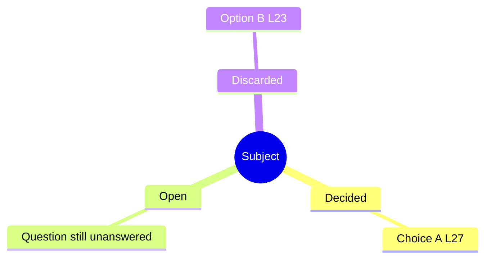
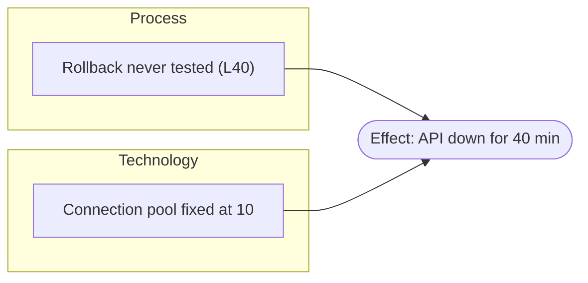
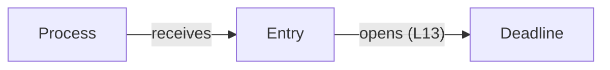
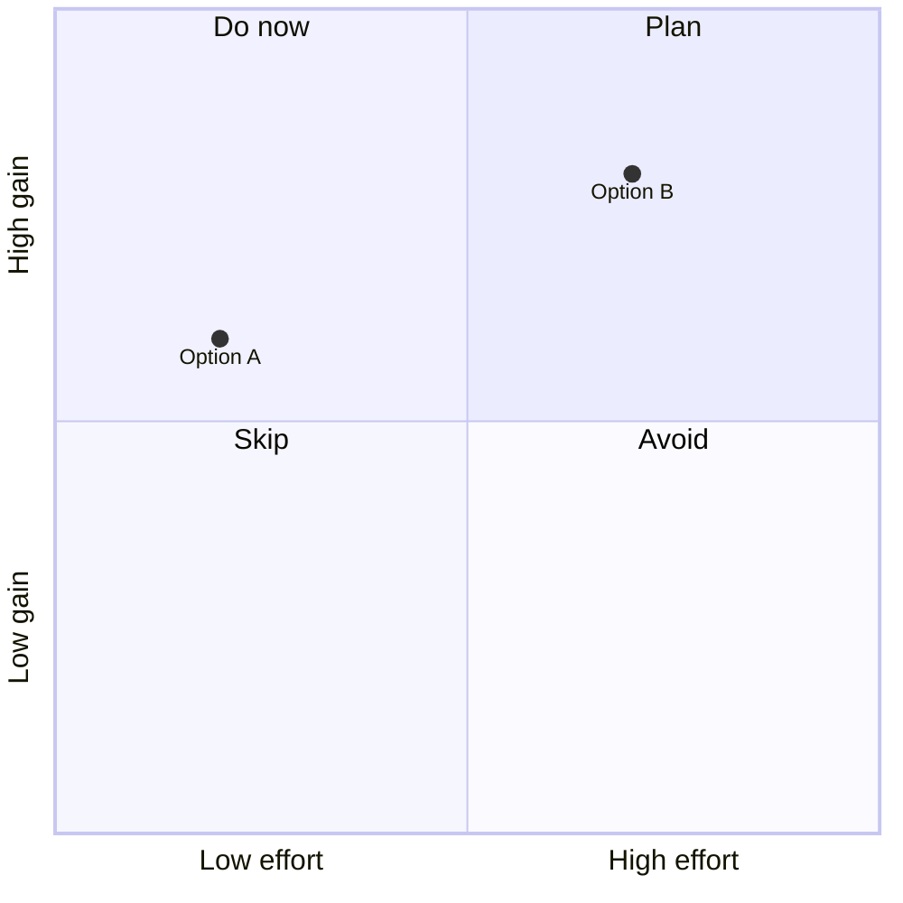

# Diagram skeletons

Starting points for the diagrams in SKILL.md's *Diagram rules* table whose
syntax is less common. Each skeleton was validated with mermaid-cli 12; keep
its shape and replace the content. Cite `L<n>` inside a label only when it
fits in a few words.

## Mind map: what is settled, what is open

Root = the subject. The three branches are fixed and translated with the
digest; drop a branch with no content.

No `classDef` and no legend: branch position already says what each item is.

## Ishikawa: why did it happen

Causes grouped by category, all converging on the effect. Categories fit
software: People, Process, Technology, Environment, and Data when data is in
play. Keep only the categories with causes the text states.

Legend: "boxes = causes grouped by category · rounded = effect".

## Concept map: how the ideas relate

Every edge carries a verb, so each arrow reads as a sentence
("Process receives Entry").

## Quadrant: which option wins on two criteria

Only when the text itself ranks options on two criteria; positions follow
what the text says, as `[x, y]` between 0 and 1.

