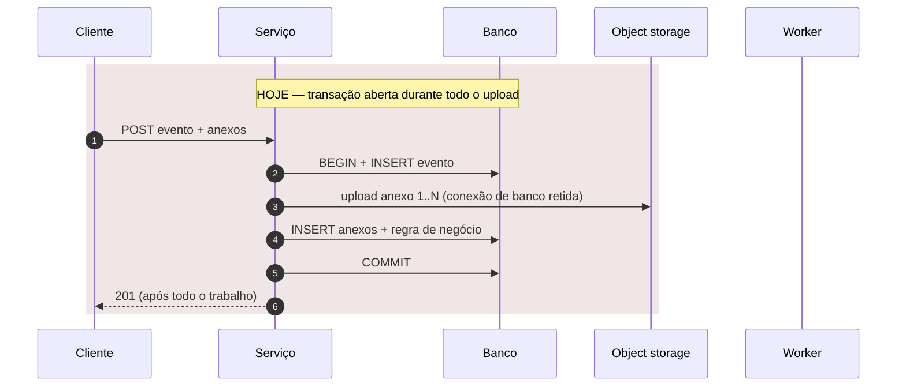
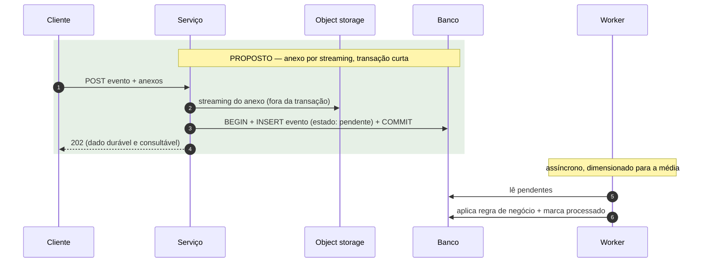

# Entregáveis

Quatro artefatos — técnico, resumo para decisão, plano e ADRs — para **duas
audiências**. Confirme o destino com o usuário
antes de escrever — default `docs/performance/` no repositório analisado.

```
docs/performance/
├── analise-<AAAA-MM-DD>.md          # técnico: para quem implementa e revisa
├── resumo-decisao-<AAAA-MM-DD>.md   # gerencial: para quem autoriza
├── plano-tuning-<AAAA-MM-DD>.md     # ordem de execução, métrica e rollback
└── adr/
    ├── 001-<decisao>.md
    └── 002-<decisao>.md
```

Os diagramas vão em Mermaid dentro dos próprios relatórios — nada de
dependência externa para renderizar. Se o usuário pedir um arquivo único
para circular, gere `RELATORIO-PERFORMANCE-<data>.md` por concatenação dos
quatro, com um aviso no topo apontando os arquivos estruturados como fonte.
Nunca edite a consolidada; regenere.

## Índice
- [1. Relatório técnico](#1-relatório-técnico)
- [2. Resumo para decisão](#2-resumo-para-decisão)
- [3. Plano de tuning](#3-plano-de-tuning)
- [4. ADR por decisão arquitetural](#4-adr-por-decisão-arquitetural)
- [5. Diagramas](#5-diagramas)

## 1. Relatório técnico

Arquivo: `docs/performance/analise-<AAAA-MM-DD>.md`

Leitor: quem vai implementar, revisar e discordar com base em evidência.
Aqui vai arquivo e linha, aritmética completa, comando que gerou cada
número. É a **fonte de verdade**: o resumo para decisão aponta para ele.

```markdown
# Análise de Performance — <sistema> — <data>

**Escopo:** <serviços/versões>. **Ambiente:** <cluster/namespace>.
**Postura:** somente leitura — nada foi alterado.

## Sumário executivo

Cinco linhas, no máximo. O objetivo, o veredito (atinge / não atinge / não é
possível afirmar), o gargalo principal, a mudança de maior impacto, e o que
ainda não foi medido. Seguido da **proposta em uma tabela**:

| # | Problema | Ação | Quantidade / dimensionamento | Quando |
|---|---|---|---|---|

É a tabela que o leitor procura. Cada linha é uma ação executável
("subir de 1 para 4 réplicas com `requests` 1 Gi / 500m", "criar índice em
(placa, data)", "separar o processamento em consumidor próprio", "publicar
com confirm antes de responder"), não uma categoria ("melhorar o banco").

## Objetivo, alvo e SLO

Objetivo primário e restrições. Depois a tabela:

| Item | Valor | Origem |
|---|---|---|
| Volume/dia atual | | medido (fonte) / declarado |
| Volume/dia alvo | | declarado |
| req/s médio | | calculado |
| Fator de pico horário | | medido / premissa (tabela) |
| Fator de rajada (1 s) | | medido / premissa |
| req/s de pico de projeto | | calculado (fator X, margem Y) |
| Tempo de resposta alvo | | declarado / premissa |
| Tolerância a perda | | declarado / premissa |
| Janela de "consultável" | | declarado / premissa |
| Restrições | | declarado |

### Aritmética completa

A conta inteira, não só o resultado — quem revisa precisa poder discordar do
fator de pico. Storage por retenção e crescimento do banco quando houver
dado persistido; registros/s quando for batch; custo por requisição quando
for custo.

## Mapa do sistema e cenário atual

Componentes no caminho do objetivo, nomeados como no repositório;
dependências externas; **o que é compartilhado entre réplicas**. Fluxo da
requisição hoje (diagrama), com o passo lento marcado. Infraestrutura atual
(réplicas, recursos, probes, HPA, uso real medido).

## Gargalos

| # | Gargalo | Tipo | Evidência | Impacto no alvo | Esforço |
|---|---|---|---|---|---|

Só entram itens com evidência. `Tipo` é causa raiz ou agravante; hipótese
plausível mas não confirmada vai na tabela seguinte, nunca aqui.

### Hipóteses não verificadas

| Hipótese | Por que é plausível | Medição que confirma |
|---|---|---|

Esta seção não é apêndice — é o que separa análise de adivinhação. Se
estiver vazia, ótimo; se estiver cheia, o primeiro item do plano é
instrumentação.

### Achados fora de escopo

Defeito funcional encontrado de passagem (NPE, log ilegível, bug que não é
performance). Uma linha por item, com arquivo e linha. Não entra na tabela
de gargalos.

## Arquitetura alvo

### O que não muda — e por quê
Tabela. Tão importante quanto o que muda: é o que impede "reescrever tudo".

### O que muda — proposta de solução
Diagrama proposto. Depois, a tabela completa:

| # | Problema (gargalo #) | Ação | Dimensionamento e premissa | ADR | Esforço |
|---|---|---|---|---|---|

Regras da tabela:
- **Toda ação é quantificada.** Réplicas com a conta (`pico ÷ capacidade
  por réplica + 1`), `requests`/`limits` com o uso medido que os justifica,
  tamanho de pool pela Little's Law, TTL de cache pela frequência de
  mudança do dado, teto de fila pelo que cabe em memória.
- **Premissa declarada onde a medição falta.** "4 réplicas (premissa: 100
  req/s por réplica; confirmar no item 0.6 do plano — se for 50, são 7)".
  A proposta existe hoje; a medição a corrige depois.
- **Hipótese também recebe ação**, condicionada: "se o trace confirmar
  serialização no gerador de ID → sequence com cache 1000; se não → nada".
- **Componentes novos aparecem como tal**: "criar serviço X", "adicionar
  Redis", "criar fila Y" — com a razão numérica e o custo operacional na
  tabela de custos.
- Nada termina em "avaliar", "estudar" ou "medir" sem a ação que vem depois
  de cada resultado possível.

## Custos

| Item | Custo | Observação |
|---|---|---|

Storage, licença, nó, complexidade operacional, gente para operar.

## Riscos e o que fica em aberto

Riscos **da mudança proposta** (não do sistema atual) com mitigação;
decisões que dependem de negócio/jurídico; o que ficou sem medir, numerado.

## Inventário de evidências

| # | Fonte | Quando | Como (comando / consulta / arquivo) | O que mostrou |
|---|---|---|---|---|

E, embaixo: **fontes oferecidas e não usadas**, com o motivo (sem acesso,
`403`, metrics-server ausente, usuário pulou).
```

## 2. Resumo para decisão

Arquivo: `docs/performance/resumo-decisao-<AAAA-MM-DD>.md`

Leitor: quem autoriza orçamento, prazo e prioridade, e **não vai ler
código**. Uma a duas páginas. Não é o técnico resumido — é outro documento,
escrito para outra pergunta: *"o que eu preciso decidir, por quê, e o que
acontece se eu não decidir"*.

Regras deste documento:

- **Zero** nome de arquivo, linha, comando, trecho de código, nome de classe.
- **Zero** sigla ou termo técnico sem explicação na mesma frase. Use a tabela
  de tradução abaixo.
- Números **arredondados** (dois algarismos significativos) e **sempre com
  uma comparação** ("200 vezes o volume de hoje", "o equivalente a 4 anos de
  fotos de todo o órgão"). Faixa aparece como faixa, com o motivo da
  incerteza ("entre 0,6 e 7 petabytes, porque ninguém mediu o tamanho da
  imagem ainda").
- **Todo número existe no relatório técnico.** Nada novo aqui. Rodapé
  apontando o técnico como fonte.
- Analogia é bem-vinda quando explica um mecanismo (o "recibo antes de
  guardar" explica durabilidade melhor que qualquer termo).
- Começa pelo que **está certo**. Quem lê "precisamos mudar 20 coisas"
  conclui "reescrever"; quem lê "6 decisões estão certas e 5 precisam de
  ajuste" conclui "ajustar".
- Um diagrama simples é permitido (4 a 6 caixas, `flowchart`), sem nome de
  componente interno — "radar", "recebimento", "fila", "banco".

```markdown
# <Sistema> — o que decidir antes de <objetivo em linguagem de negócio>

<Duas ou três frases de contexto: o que vai acontecer no negócio, em que
ordem de grandeza, e o que este documento responde.>

## Veredito

<Uma frase em negrito: atinge / não atinge / não dá para afirmar ainda — e
o porquê em linguagem de negócio.> <Um parágrafo: qual é o problema central
e por que a correção é maior ou menor do que parece.>

| <N> | <N> | <N> |
|---|---|---|
| já falham hoje | precisam mudar antes do volume | decisões certas a manter |

## O que já está certo e vamos manter

<Uma entrada por decisão mantida: título curto + um parágrafo dizendo por
que trocar seria caro e não resolveria nada.>

## O problema central, explicado

<Uma imagem ou analogia; opcionalmente um flowchart "hoje" vs "proposto"
de poucas caixas. O leitor precisa sair daqui entendendo o mecanismo, não
o nome dele.>

## O que precisa mudar

<3 a 7 itens. Cada um: o que muda (uma frase, concreta: "passar de uma para
quatro cópias do serviço de recebimento", "criar um serviço separado para o
cálculo da infração"), por que (uma frase), quando (antes/depois de ligar o
volume), esforço em ordem de grandeza (dias, semanas, um trimestre). Sem
código. O leitor sai daqui sabendo o que vai ser feito, não só o que está
errado.>

## O que só a gestão pode decidir

<Retenção de dado, orçamento, contrato com fornecedor/fabricante, prazo,
prioridade entre objetivos. Para cada uma: a pergunta, as opções, o que
cada opção custa em ordem de grandeza.>

## O que ainda não sabemos — e como vamos descobrir

<Medições pendentes em linguagem simples, cada uma com o que ela decide e
quanto tempo leva. É o que sustenta a honestidade do veredito.>

## Por onde começar

<As três primeiras ações, em ordem, com o que muda quando cada uma
estiver feita e quanto tempo leva.>

## Os números que decidem

| Número | Valor | O que significa |
|---|---|---|
<Até cinco linhas, arredondadas, cada uma com uma frase de significado.>

---
Base: `analise-<data>.md` (relatório técnico, com evidência e método).
```

### Tabela de tradução técnico → gerencial

Não é lista fechada; é o padrão de como traduzir.

| No técnico | No resumo para decisão |
|---|---|
| p95 de 300 ms | 19 em cada 20 respostas em menos de um terço de segundo |
| p99 | a resposta mais lenta a cada cem |
| req/s, throughput | passagens (pedidos, documentos) por segundo |
| `OOMKilled`, restart | o serviço ficou sem memória e foi reiniciado pelo ambiente; o que estava em andamento se perdeu |
| pool de conexões exausto | todas as vagas de acesso ao banco ocupadas; novos pedidos ficam esperando |
| transação longa / I/O na transação | segurar a vaga do banco enquanto faz outra coisa (enviar a imagem, chamar outro sistema) |
| idempotência | receber o mesmo pedido duas vezes não gera dois registros |
| durabilidade antes da resposta | só dizer "recebido" depois de guardar |
| réplica / escala horizontal | cópias do serviço rodando em paralelo |
| HPA | cópias adicionadas e removidas automaticamente conforme a demanda |
| `requests`/`limits` | reserva e teto de recursos de cada cópia |
| backpressure, `429`/`503` | dizer "estou cheio, tente de novo em 30 s" em vez de aceitar e perder |
| fila / broker | a fila que absorve a rajada para o processamento consumir no seu ritmo |
| object storage | o armazém de arquivos, separado do banco |
| particionamento | dividir a tabela por mês para que apagar o antigo seja instantâneo |
| índice | o "índice do livro" que evita ler todas as páginas para achar uma placa |
| cache | guardar a resposta pronta para não recalcular a cada pedido |
| ADR | registro de decisão (o que foi decidido, o que foi descartado, por quê) |
| quick win | ajuste rápido, sem mudança de estrutura |
| hipótese não verificada | suspeita ainda não confirmada por medição |
| SLO | o compromisso de desempenho que vamos medir e cobrar |
| fator de rajada | quantas vezes a pior fração de segundo supera a média |

## 3. Plano de tuning

Arquivo: `docs/performance/plano-tuning-<AAAA-MM-DD>.md`

Quatro blocos em ordem de execução (numerados como Bloco 0–3 para não
confundir com as fases do workflow). Cada item tem métrica de validação e
critério de rollback — item sem métrica não é plano, é intenção.

```markdown
# Plano de Tuning — <sistema> — <data>

Alvo: <uma linha>. Base medida: <uma linha>. **Nada foi aplicado.**

## Bloco 0 — Instrumentação e medição

Só existe se houver hipótese em aberto — e quase sempre há. É a fase de
maior retorno de informação por esforço.

| # | Medição | Onde | Hipótese que resolve | Esforço |
|---|---|---|---|---|

## Bloco 1 — Quick wins (configuração e tuning, sem mudança de arquitetura)

| # | Mudança | Onde | Gargalo | Métrica que valida | Rollback | Esforço |
|---|---|---|---|---|---|---|

### Blocos para revisão
Cada mudança como código/comando/YAML/SQL, comentado, para o time aplicar.
Pré-requisitos e cuidados como nota abaixo do bloco.

## Bloco 2 — Mudanças estruturais

| # | Mudança | ADR | Onde | Métrica que valida | Rollback | Esforço |
|---|---|---|---|---|---|---|

Cada item referencia o ADR que o decidiu.

## Bloco 3 — Opcional (só se o número exigir)

| # | Mudança | Gatilho que a justifica | Esforço |
|---|---|---|---|

O "gatilho" é o número que, ao ser atingido, torna o item necessário.
Sem gatilho, o item não deveria estar no plano. Tecnologia que o usuário
pediu e o número não sustenta entra aqui, com "nenhum gatilho de X
justifica" e a razão de arquitetura que justificaria.

## Ordem de execução resumida

Um diagrama de texto: blocos, duração em ordem de grandeza, o que cada uma
destrava.
```

Ordem não é negociável: instrumentação antes de otimização, quick win antes
de mudança estrutural. Um plano que começa por reescrever o serviço é um
plano que nunca vai ser executado.

## 4. ADR por decisão arquitetural

Arquivo: `docs/performance/adr/NNN-<decisao-em-kebab-case>.md`

Um ADR por decisão que seja difícil de reverter depois. Se a decisão é
trivial de mudar, não precisa de ADR. Decisão **condicionada a medição**
("manter X por ora; trocar se o teste mostrar Y") também é ADR — e dos mais
úteis, porque impede a troca por intuição.

```markdown
# ADR NNN — <decisão>

- **Data:** <AAAA-MM-DD>
- **Status:** proposto | aceito | descartado | condicionado a medição | substituído por ADR NNN

## Contexto
O problema e o número que o torna um problema. Sem o número, não há decisão
a tomar.

## Decisão
O que será feito, em uma ou duas frases. Se condicionada: o gatilho.

## Alternativas descartadas
| Alternativa | Por que foi descartada |
|---|---|
Inclua "não fazer nada" sempre que for defensável — em metade dos casos é,
e o ADR fica mais honesto ao dizer por que não. Inclua a alternativa que
viola uma restrição do usuário, dizendo qual.

## Consequências
O que fica melhor, o que fica pior, o que passa a exigir operação ou
monitoramento que antes não existia.

## Custo
Financeiro, operacional e de complexidade.
```

## 5. Diagramas

Dois diagramas, no mínimo, no relatório técnico:

1. **Fluxo atual** — o que acontece hoje entre o cliente e o dado persistido.
2. **Fluxo proposto** — o mesmo caminho depois das mudanças.

Os dois precisam mostrar, explicitamente, quatro coisas — sem elas o diagrama
não ajuda a decidir nada, é desenho de caixinhas:

- a **fronteira transacional** (o que é atômico com o quê);
- **para onde vai o anexo** (banco, heap, storage externo) — quando houver;
- **o que é síncrono e o que é assíncrono**;
- **onde o dado se torna consultável** (ou, em leitura, **de onde a resposta
  sai**: cache, réplica, banco).

Use `sequenceDiagram` quando o ponto é *quando* cada coisa acontece e o que
segura a resposta:





Use `flowchart` quando o ponto é a **topologia** — componentes, réplicas,
onde o dado repousa — e é o formato do diagrama do resumo para decisão.
Vale um terceiro diagrama de deploy (réplicas, HPA, banco, storage) quando a
proposta muda a escala.

Regras para os diagramas não mentirem:

- No técnico, nomeie os componentes como eles se chamam no repositório. No
  gerencial, pelo papel ("recebimento", "fila", "banco").
- Marque no diagrama atual **onde o tempo é gasto** (o passo lento), não só a
  ordem das chamadas.
- Se algo no diagrama é hipótese (fluxo que você não conseguiu confirmar no
  código), diga isso na legenda abaixo do bloco.
